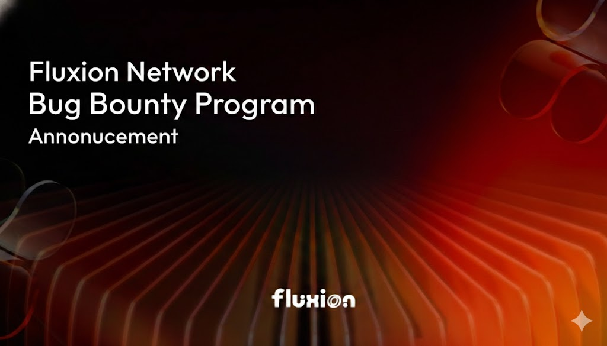

# Fluxion Network Bug Bounty Program

To ensure the highest level of security for the Fluxion Network ecosystem, we are officially launching the **Fluxion Sentinel Initiative**. We invite security researchers and white-hat hackers to help us identify and resolve potential vulnerabilities in our protocol.
****

### **01. Rewards & Tiers**

We have allocated a dedicated pool for this program. Rewards are distributed based on the severity of the vulnerability as classified by the Fluxion team.

| **Severity** | **Description** | **Reward (USDT + MNT)** |
| --- | --- | --- |
| **High** | Critical logic bugs, potential loss of funds, or severe manipulation of liquidity pools. | **$1,000 - $2,500** |
| **Medium** | Unauthorized access to non-critical functions, oracle price deviations, or logic errors. | **$300 - $1,000** |
| **Low** | Minor contract vulnerabilities, front-end security risks, or information leaks. | **Up to $300** |

### **02. Scope**

The bounty program primarily focuses on the following areas:

  • **Smart Contracts:** Core v2/v3 liquidity pool logic, swap mechanisms, and concentrated liquidity modules.
  
  • **Protocol Security:** Re-entrancy, flash loan resistance, and mathematical boundary conditions.
  
  • **Network Infrastructure:** Cross-chain communication protocols and consensus layer stability.
****

### **03. How to Participate & Report**

To participate, please follow the coordinated disclosure process:

1. **Identification:** Discover a vulnerability within the defined scope. 
2. **Report:** Send a detailed report to **contact@fluxion.network**.
    ◦ **Subject:** [BUG BOUNTY] - Severity Level - Brief Description
    ◦ **Content:** Detailed explanation of the bug, potential impact, and a **Proof of Concept (PoC)** (e.g., scripts, transactions, or step-by-step reproduction instructions). 
3. **Evaluation:** Our security team will acknowledge receipt within 48 hours and provide a technical evaluation. 
4. **Fix & Reward:** Once the bug is confirmed and a fix is deployed, the reward will be sent to your provided wallet address. 
****

### **04. Rules & Guidelines**

• **No Public Disclosure:** Do not share or leak the vulnerability details before a fix is officially deployed. 

• **No Malicious Exploitation:** Do not attempt to drain funds or disrupt services for real users during your research. 

• **Originality:** Only the first reporter of a specific vulnerability is eligible for the reward. 
****

### **05. Disclosure Policies**

Fluxion Network reserves the right to make the final decision on the severity of any reported bug and the corresponding reward amount. All rewards are subject to the verification of a valid PoC.
